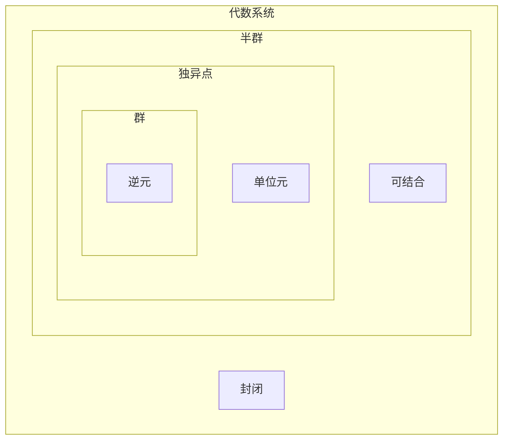

![[半群]]

若 $V$ 是独异点, 若 $\forall a \in S, a^{-1} \in S$, 则 $V$ 是群, 记为 $G$. 

![[Klein四元群]]

- 有限群: $G$ 是有穷集.
- 无限群: $G$ 是无穷集.
- 阶: 群 $G$ 的基数, 有限群的阶记为 $|G|$. 

- 平凡群: 只含 [[单位元]] 的群. 
![[阿贝尔群]]

![[群中元素的幂]]

![[元素的阶]]

![[消去律]]

![[群中方程存在唯一解]]

![[群中无零元]]